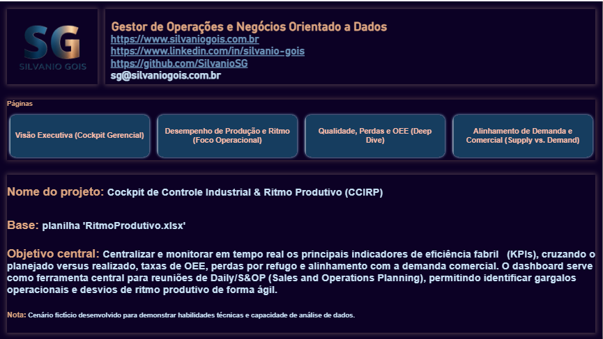
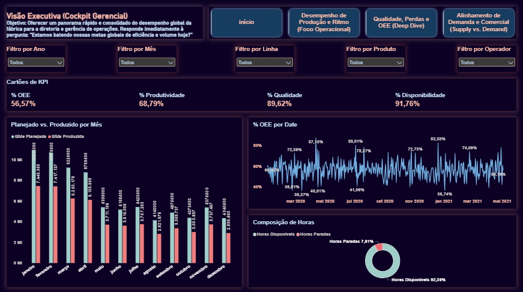
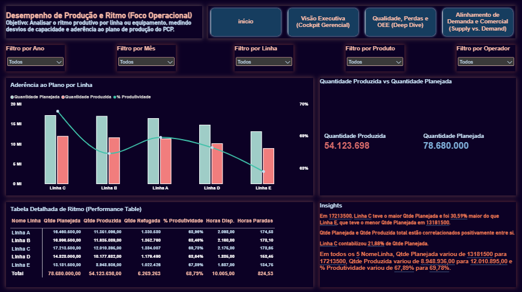
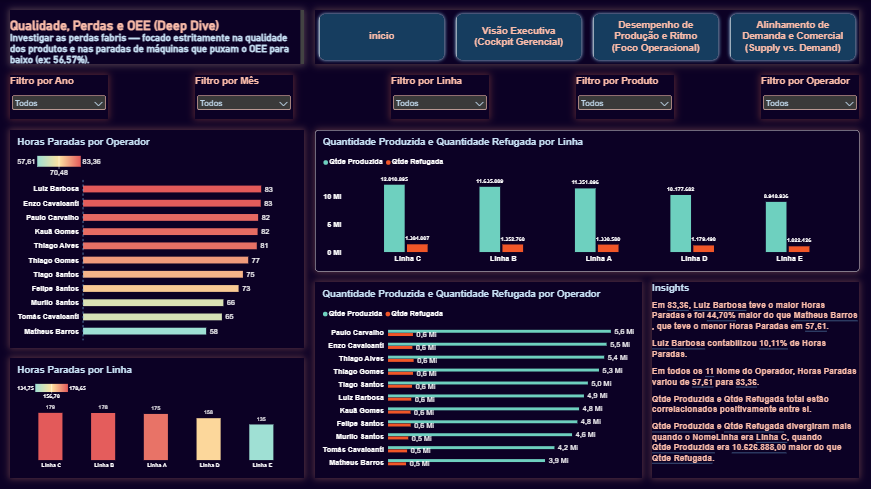
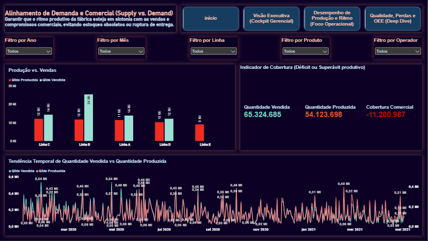

# Cockpit de Controle Industrial & Ritmo Produtivo (CCIRP)

**Autor:** Silvanio Gois — Gestor de Operações e Negócios Orientado a Dados  
**Contatos Profissionais:** [Website Oficial](https://www.silvaniogois.com.br) | [LinkedIn](https://www.linkedin.com/in/silvanio-gois/) | [GitHub](https://github.com/SilvanioSG) | **E-mail:** sg@silvaniogois.com.br  
**Demonstração Online:** [Acessar Dashboard Interativo no Power BI Service](https://app.powerbi.com/view?r=eyJrIjoiM2RkOTc2NGMtMGEzYy00OWFmLTkxZGMtMzNmYWIwZjFlMzE5IiwidCI6IjJlYmQyYzU0LWY1ZDMtNGVmYi05ZGE3LWU4Yzk0YmQyMWQzOSJ9)

---

## 1. Visão Geral do Projeto

O **Cockpit de Controle Industrial & Ritmo Produtivo (CCIRP)** é uma solução analítica de Business Intelligence desenvolvida para centralizar, monitorar e otimizar os indicadores de eficiência da operação fabril. A aplicação consome dados operacionais da base `RitmoProdutivo.xlsx` e os estrutura em visões táticas e executivas voltadas ao suporte de reuniões operacionais diárias (Daily) e alinhamentos de planejamento de vendas e operações (S&OP).

O objetivo principal consiste em rastrear desvios de capacidade, taxas de eficiência global dos equipamentos (OEE), perdas por refugo de qualidade e o equilíbrio entre a taxa de produção real e as demandas comerciais.

---

## 2. Metodologia Técnica e Arquitetura de Dados

A solução foi desenvolvida seguindo as melhores práticas de modelagem dimensional e engenharia de BI:

* **Tratamento e ETL (Power Query):** Sanitização, normalização e validação dos dados transacionais extraídos da planilha de origem (`RitmoProdutivo.xlsx`), garantindo a integridade relacional entre registros de produção, paradas e refugos.
* **Modelagem Dimensional (Star Schema):** Estruturação de tabelas de fatos (operações fabris e vendas) conectadas a tabelas dimensão (Linhas, Produtos, Operadores e Tabela Calendário dedicada para operações avançadas de *Time Intelligence*).
* **Modelagem de Métricas (DAX):** Formulação de cálculos para suportar os três pilares fundamentais do OEE e indicadores operacionais de capacidade:
  $$\text{OEE} = \text{Disponibilidade} \times \text{Desempenho} \times \text{Qualidade}$$
* **Design e UI/UX Industrial:** Interface em estilo dark mode corporativo, desenvolvida para reduzir a fadiga visual em ambientes de salas de controle e chão de fábrica, permitindo a pronta identificação de gargalos através de hierarquias visuais claras e codificação por cores funcionais.

---

## 3. Relatório Executivo e Telas do Cockpit

### Tela Inicial / Apresentação

---

### Visão Executiva (Cockpit Gerencial)

* **Objetivo:** Fornecer à diretoria e à gerência um panorama imediato do desempenho global da fábrica e do cumprimento das metas corporativas.
* **Métricas Consolidadas:**
  * **OEE Global:** $56,57\%$
  * **Produtividade / Desempenho:** $68,79\%$
  * **Qualidade:** $89,62\%$
  * **Disponibilidade:** $91,76\%$
  * **Distribuição de Horas:** $92,39\%$ de Horas Disponíveis vs. $7,61\%$ de Horas Paradas.

---

### Desempenho de Produção e Ritmo (Foco Operacional)

* **Objetivo:** Avaliar a aderência do ritmo produtivo ao plano definido pelo PCP, detalhando a performance por linha de fabricação.
* **Análise de Capacidade:**
  * **Quantidade Planejada Total:** $78.680.000,00$ unidades.
  * **Quantidade Produzida Total:** $54.123.698,00$ unidades.
  * **Aderência ao Plano:** Destaque para a Linha C com o maior volume planejado ($17,21\text{M}$ unidades) e a maior quantidade produzida ($12,01\text{M}$ unidades), apresentando $69,78\%$ de produtividade.

---

### Qualidade, Perdas e OEE (Deep Dive)

* **Objetivo:** Diagnosticar os causadores de perda de eficiência, identificando o volume de materiais refugados e os gargalos de paradas por máquina e por operador.
* **Diagnóstico de Perdas:**
  * **Refugo Acumulado:** $6.269.263,00$ unidades rejeitadas no processo.
  * **Análise por Recursos:** Correlação entre volume produzido, refugos por linha e o ranking de horas paradas por operador (liderado por Luiz Barbosa com $83,36$ horas paradas).

---

### Alinhamento de Demanda e Comercial (Supply vs. Demand)

* **Objetivo:** Confrontar a capacidade produtiva fabril com a demanda de vendas comercial, identificando riscos de desabastecimento ou sobre-estoque.
* **Balanço Comercial:**
  * **Quantidade Vendida:** $65.324.685,00$ unidades.
  * **Quantidade Produzida:** $54.123.698,00$ unidades.
  * **Cobertura Comercial (Déficit):** $-11.200.987,00$ unidades (evidenciando gargalo de suprimento frente à demanda do mercado).

---

## 4. Análise Crítica e Insights Estratégicos

1. **Gargalo de Performance (OEE):** Embora a taxa de **Disponibilidade** operacional seja elevada ($91,76\%$), o **OEE Global** é penalizado ($56,57\%$) devido à baixa taxa de **Produtividade/Desempenho** ($68,79\%$). Isso indica que o maquinário opera durante a maior parte do tempo programado, porém abaixo da velocidade nominal ou sofrendo microparadas não mapeadas.
2. **Defasagem entre Demanda e Produção (Supply Gap):** O déficit comercial de mais de $11,2\text{ milhões}$ de unidades revela um desalinhamento crítico entre a meta comercial e a capacidade de entrega da fábrica, exigindo aumento de cadência ou revisão das promessas de entrega no S&OP.
3. **Custo de Não Qualidade:** A rejeição de $6,26\text{ milhões}$ de peças ($10,38\%$ de perda em refugo) aponta oportunidade imediata de ganho de margem e capacidade através de intervenções nos processos de controle de qualidade e manutenção preventiva.

---

## 5. Estrutura de Arquivos do Repositório
#### Nota: Cenário fictício desenvolvido para demonstrar habilidades técnicas e capacidade de análise de dados.

* `RitmoProdutivo.xlsx`: Base de dados transacional bruta utilizada na carga de dados.
* `RitmoProdutivo.pbix`: Arquivo do Power BI com o modelo relacional, DAX e painéis visuais.
* `RitmoProdutivo.pdf`: Exportação oficial do relatório em formato PDF para distribuição offline.
* `pagina0`, `pagina1`, `pagina2`, `pagina3`, `pagina4`: Imagens de alta resolução representando as páginas do dashboard.

---

## 6. Licença

Este projeto foi criado por **Silvanio Gois** para demonstrar aplicação prática de Business Intelligence e gestão de operações orientada a dados. Todos os direitos reservados.
